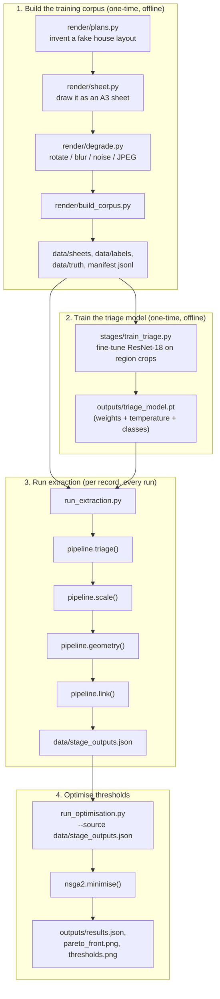
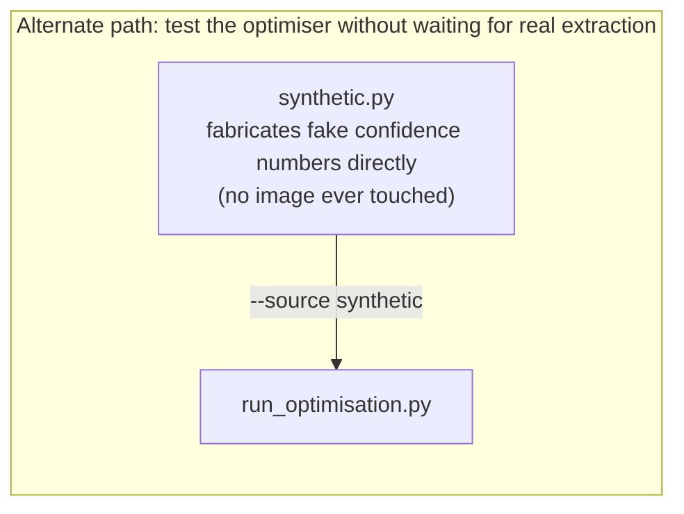
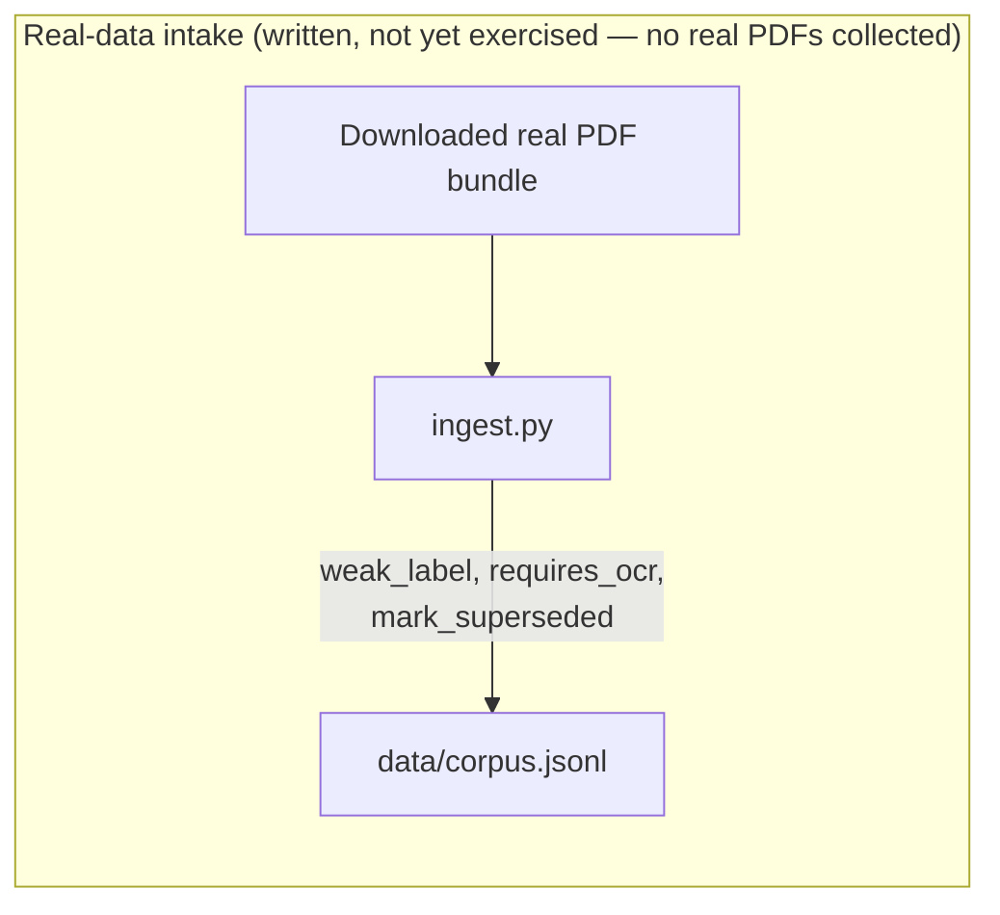

# Architecture

How the pieces of this repository fit together. For what each individual
function does, see [TECHNICAL.md](TECHNICAL.md). For the exact commands
to run everything in order, see [WORKFLOW.md](WORKFLOW.md).

## The shape of the problem

A four-stage extraction pipeline (triage → scale → geometry → link) reads
a building's ground-floor footprint, storey count, and room count off a
planning drawing. Every stage emits a **calibrated confidence** alongside
its answer, and is allowed to **abstain** instead of guessing. Because the
four stages are not equally hard or equally costly to get wrong, picking
the right confidence threshold for each one is a three-objective
optimisation problem (error rate, coverage, review cost), solved with
NSGA-II.

## System diagram

The alternate path (`synthetic.py`) and the real-data-intake path
(`ingest.py`) are both **independent** of the main four-stage flow above —
neither one feeds into or out of it. This is a common point of confusion:
`synthetic.py` produces numbers, never images; `build_corpus.py` produces
images, never touches `synthetic.py`.

## Data contracts — `src/contracts.py`

The vocabulary every other module shares:

- **`Stage`** — enum of the four stages, in execution order. Order matters:
  it determines the review-cost model (abstaining at `TRIAGE` is cheap, at
  `LINK` is expensive) and which stage "fails first" when a record is
  routed.
- **`StageOutput`** — one stage's result: a mandatory `confidence` in
  `[0, 1]`, plus a `payload` dict of whatever it extracted.
- **`PropertyRecord`** — one property as it moves through the pipeline.
  Accumulates one `StageOutput` per stage. `confidence_vector()` is the
  array the optimiser thresholds against; `prediction()` lets a later
  stage (e.g. `geometry`) read an earlier stage's output (e.g. the
  recovered scale) without a direct dependency between the two functions.

This one rule — every stage must emit a confidence, none may silently
fail — is what makes the whole optimisation layer possible at all.

## Building the training corpus — `src/render/`

Real drawings usually come one type per page (a "floor plans.pdf", an
"elevations.pdf"). This project instead composites every drawing type
onto one page, matching a real Exeter planning sheet it was modelled on.
Hand-labelling hundreds of such pages would be slow, so `render/` invents
and draws its own, with guaranteed-correct labels for free:

- **`plans.py`** decides the geometry — a random house shape (over half
  L-shaped, since a rear extension is both the realistic case and the
  harder one to measure), subdivided into rooms that are guaranteed to
  exactly tile the footprint with no gaps.
- **`sheet.py`** draws that geometry as a full A3 page: floor plan, 2
  elevations, site plan (deliberately drawn at a different scale — a real
  trap copied from the real sheet this project is modelled on), scale bar,
  north arrow, title block. Every drawn region is recorded with its exact
  pixel location.
- **`degrade.py`** makes some sheets deliberately worse (4 levels — see
  below), because a real national corpus is mostly imperfect scans, not
  clean digital exports.
- **`build_corpus.py`** runs the above `n` times and writes the sheets,
  YOLO-format labels, and per-sheet truth JSON, plus one combined
  `manifest.jsonl`.

### Degradation levels

| Level | What changes | Real-world equivalent |
|---|---|---|
| 0 | Nothing | Clean digital export |
| 1 | Mild JPEG + slight resize | **The common case** — passed through a print driver |
| 2 | + rotation, blur, noise, lower contrast | Scanned on a flatbed scanner |
| 3 | Heavier versions of all of the above; room labels sometimes dropped; scale bar sometimes missing | A photocopy of a scan |

## Training the real model — `src/stages/train_triage.py`

Trains a ResNet-18 (pretrained on ImageNet, final layer replaced) to
classify a cropped region into one of 8 classes. Trains on **regions**,
not whole pages, because the rendered sheets combine multiple drawing
types onto one page — the "page classification" the real pipeline
eventually needs becomes "region classification" against this corpus.

After training, **temperature scaling** fits one scalar `T` that corrects
the model's confidence to match its real accuracy (freshly trained models
are typically overconfident), without changing which answer it picks. A
**reliability diagram** then plots claimed confidence against real
accuracy per confidence bucket, to verify the fix actually worked. The
checkpoint saved at the end (`outputs/triage_model.pt`) bundles the
trained weights, the fitted temperature, and the class list — all three
are needed together to reproduce a correctly-calibrated prediction later.

## The extraction stages — `src/stages/pipeline.py`

All four stages are implemented (this used to be a set of stubs in
earlier project stages — it no longer is):

- **`triage()`** — loads the trained checkpoint, classifies one image
  crop, returns a temperature-scaled confidence.
- **`scale()`** — measures the scale bar's tick pattern. Scores every row
  of the crop by how many consistent tick-width stripes it produces
  (not by raw ink density, and not by assuming the geometric middle row —
  both were tried and both broke on real cases; see the note below).
  Converts the measured tick width into a scale denominator assuming a
  150 dpi render.
- **`geometry()`** — reads the scale `scale()` recovered (via
  `PropertyRecord.prediction()`, not a direct function argument, so a
  missing scale correctly makes geometry abstain too), thresholds the
  floor-plan image, and uses contour hierarchy (`cv2.RETR_CCOMP`) to get
  both the building outline (footprint area) and its room count in one
  pass — every room the renderer drew becomes a hierarchy child of the
  outer wall contour.
- **`link()`** — matches an extracted address against a candidate list
  using string-similarity scoring; confidence is the margin between the
  best and second-best match.

**A real bug worth knowing about, because it shaped the design:** `scale()`
originally measured a single, fixed row (the crop's geometric middle).
Rotation is applied to the whole sheet *after* regions are already laid
out against the clean render, so on a rotated sheet the scale bar's thin
(~26px) crop can have its tick pattern shifted enough that the middle row
misses it almost entirely — silently producing a scale wrong by several
times, and an area wrong by the square of that. The fix scores every row
by how much it actually looks like an alternating tick pattern, which
turned out to require more care than "most ink in the row" (the tick
band's own outline borders are *denser* than the real pattern, so that
naive fix broke ordinary clean sheets instead).

## Running extraction — `src/run_extraction.py`

The driver that actually exercises the four stages against the rendered
corpus. For every sheet, it classifies **every** region through
`triage()` using triage's own predictions only — it never reads the
manifest's ground-truth region class, since a real bundle wouldn't have
one to read. It picks the best `floor_plan` and `scale_bar` matches,
collects all `elevation` matches, and runs `scale → geometry → link` in
order. A stage returning zero confidence (no scale bar found, no closed
contour, no address match) is treated as a normal, valid outcome — not a
script error. Every record, whatever it managed to complete, is written
to `data/stage_outputs.json`.

## Optimising thresholds — `src/run_optimisation.py`, `src/nsga2.py`, `src/objectives.py`

`objectives.EvaluationMatrix` converts a batch of `PropertyRecord`s into
plain numpy arrays and defines the three objectives NSGA-II minimises:
error rate among accepted records, `1 - coverage`, and expected review
cost. `nsga2.py` is a from-scratch implementation of the NSGA-II
algorithm (non-dominated sorting, crowding distance, simulated binary
crossover, polynomial mutation) — owned directly rather than imported,
reasonable at only 4 decision variables. `run_optimisation.py` wires it
together: load data → run the optimiser → compare against the best
possible single shared threshold → sweep several cost ratios → save two
plots and a `results.json`.

`load()` in `run_optimisation.py` accepts either `"synthetic"` (calls
`synthetic.generate()`, fabricated numbers, no images involved) or a path
to a real `data/stage_outputs.json` file (via `load_real()`, which
reconstructs full `PropertyRecord` objects from the JSON). Both paths
produce the exact same object type, so nothing downstream needs to know
or care which one supplied the data.

## Status of each component

| Component | Status |
|---|---|
| Data contracts (`contracts.py`) | Done |
| Corpus renderer (`render/`) | Done |
| Objectives + NSGA-II (`objectives.py`, `nsga2.py`) | Done |
| Triage training (`train_triage.py`) | Done |
| All four extraction stages (`pipeline.py`) | Done |
| Extraction driver (`run_extraction.py`) | Done |
| Optimiser, real-data loader (`run_optimisation.py`) | Done |
| Real-corpus intake (`ingest.py`) | Written, not yet run against real data |
| Real planning-application data | Not collected — everything above runs on the rendered corpus |
| `scale()`'s title-block OCR route | Not built — scale-bar route only |
| `link()`'s global (batch-level) assignment | Not built — per-record greedy matching only |
| EPC ground-truth join, flood-zone overlay, LIDAR cross-check | Not started |

## One record's journey, start to finish

1. `render/build_corpus.py` invents a fake property and draws it as a
   degraded sheet (or, eventually, `ingest.py` organises a real
   downloaded bundle instead).
2. `pipeline.triage()` classifies every region on the sheet.
3. `pipeline.scale()` measures the scale bar triage found.
4. `pipeline.geometry()` measures the floor plan, using that scale.
5. `pipeline.link()` matches the address.
6. `run_extraction.py` collects the resulting `PropertyRecord` (however
   far it got — a record can abstain at any stage) and writes it to
   `data/stage_outputs.json`.
7. `run_optimisation.py` loads every record, runs NSGA-II to find the
   best confidence thresholds, and reports how the accuracy/coverage/cost
   trade-off looks — and how it should shift depending on how expensive a
   wrong answer is compared to a human review.
