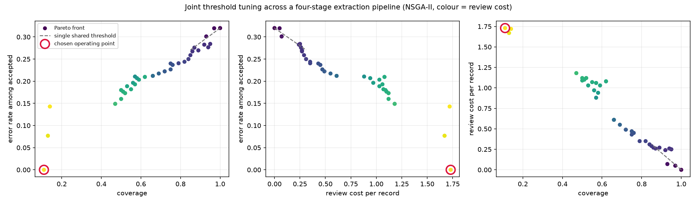
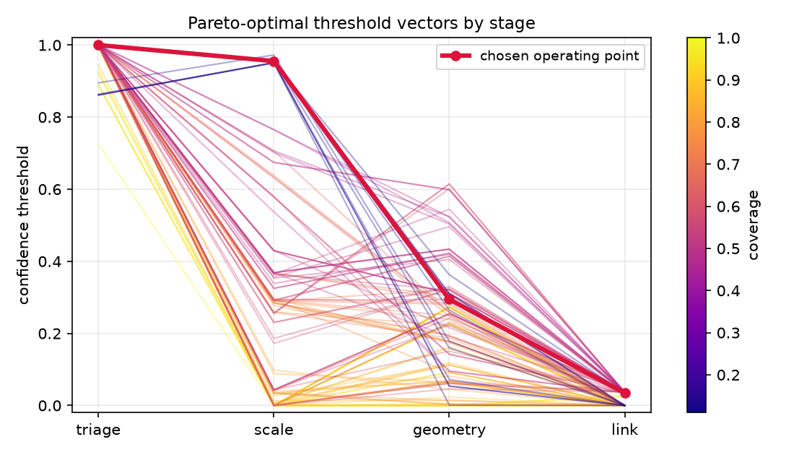

# Building geometry from planning drawings, with a defensible operating point

Extracting ground-floor footprint, storey count and room count from UK householder planning applications — and treating the choice of *when to trust the extraction* as a multi-objective optimisation problem rather than a hyperparameter someone eyeballed.

> **Status: full pipeline built and running end to end** — corpus generation, a trained and calibrated triage model, all four extraction stages, and the optimisation layer. The numbers below are real, produced by running the actual pipeline (`src/run_extraction.py` → `src/run_optimisation.py`) against a rendered corpus, not `src/synthetic.py`'s fabricated stand-in. The one remaining gap is real data: everything below still runs on synthetically rendered drawings, since no real planning-application bundles have been collected yet. See [WORKFLOW.md](WORKFLOW.md) for exact commands and [ARCHITECTURE.md](ARCHITECTURE.md) for how it fits together.

## Why this problem

Flood is the dominant UK property peril, and flood damage is overwhelmingly a ground-floor phenomenon. Ground-floor footprint, floor level, storey count and internal layout are precisely what determine reinstatement cost after a flood — which is why unlocking internal layouts at national scale is worth money to an insurer.

The Environment Agency is explicit that its Flood Zones indicate risk to an *area of land* and are not suitable for judging whether an individual property is at risk, because the dataset cannot know the details of each building. That gap is the point. Zone-level data cannot tell an insurer about an individual building; internal layout and floor level can.

## The idea

A four-stage extraction pipeline — page triage → scale recovery → geometry measurement → record linkage — where **every stage emits a calibrated confidence** and abstains rather than guessing.

That gives four thresholds. The usual move is to pick one number and apply it everywhere. But the stages are not equally hard, so a single bar is the wrong instrument, and the objectives genuinely conflict:

- **error rate among accepted outputs** — raise thresholds, this falls
- **coverage** — raise thresholds, this falls too
- **analyst review burden** — abstentions are not equal. Abstaining at triage means a human glances at a thumbnail; abstaining at geometry means a human measures the plan after the pipeline has already spent compute getting there.

Three conflicting objectives over four decision variables is a Pareto problem, and NSGA-II is the right tool. Implemented directly in `src/nsga2.py` rather than imported, since at four variables owning it is cheaper than the dependency.

## The part that is actually about insurance

A Pareto front does not tell you where to sit on it. Choosing the operating point requires knowing how much worse a confidently wrong answer is than a referral — and that is an underwriting question, not a modelling one.

A wrong ground-floor area propagates into a mispriced policy. An abstention routes to a surveyor and costs their time. The ratio between those is asymmetric and well above 1:1, but its exact value belongs to the business. So the model takes it as a parameter and reports how the answer moves:

| cost ratio | error rate | coverage | E[cost] | best shared threshold | saving |
|---|---|---|---|---|---|
| 2:1 | 0.277 | 0.940 | 0.593 | 0.015 | **5.2%** |
| 5:1 | 0.149 | 0.470 | 0.939 | 0.045 | **13.5%** |
| 10:1 | 0.000 | 0.110 | 0.977 | 0.045 | **10.0%** |
| 20:1 | 0.000 | 0.110 | 0.977 | 0.045 | **10.0%** |
| 50:1 | 0.000 | 0.110 | 0.977 | 0.045 | **10.0%** |
| 100:1 | 0.000 | 0.110 | 0.977 | 0.045 | **10.0%** |

*Real extraction output, 100 rendered sheets (`data/stage_outputs.json`). Costs are per record in units of one manual survey. The baseline is the best achievable single shared threshold found by exhaustive search at 200-point resolution — not a strawman. Hypervolume: front 0.824 vs. shared-threshold baseline 0.722 (1.14×).*

Joint tuning saves 5–14% against the best a shared threshold can do. More usefully, the sweep says something a single accuracy figure cannot: as the cost of being wrong rises from 2× to 10× a referral, automation coverage falls from 94% to 11% — and flattens there, because past that point the pipeline has already retreated to only the records it can get exactly right. **At a high enough error cost, the correct decision is not to automate most records at all** — and being able to say where that line sits is worth more than another point of accuracy.





The second figure is the empirical justification for the whole approach: Pareto-optimal threshold vectors are visibly *not* flat. Triage pins itself at essentially 1.0 on almost every front point — page classification is easy enough that there's no cost to demanding maximum confidence — while scale and geometry, the two genuinely hard stages, carry almost all of the real trade-off.

## A finding from building it

The first version of the cost model priced an abstention at review effort only. It concluded the pipeline should abstain on 98.5% of records — a vacuously perfect error rate beats any real one when abstaining is free.

The omission was that abstaining is *not* free: the number still has to be produced, by a person. Pricing an abstention at one manual survey plus stage-weighted review effort made the model behave sensibly. This is written up rather than quietly fixed because the failure is the interesting part: a cost model that ignores the counterfactual will always recommend doing nothing.

## Layout

Three companion documents cover this in more depth:

- [ARCHITECTURE.md](ARCHITECTURE.md) — how the pieces fit together, with diagrams
- [WORKFLOW.md](WORKFLOW.md) — the exact commands to run everything, in order
- [TECHNICAL.md](TECHNICAL.md) — every function, its parameters, and what it returns

```
src/contracts.py         stage output contract — confidence is mandatory
src/nsga2.py             NSGA-II: non-dominated sort, crowding, SBX, polynomial mutation
src/objectives.py        three objectives + asymmetric commercial cost model
src/synthetic.py         fabricated stage outputs, for testing the optimiser without real data
src/stages/pipeline.py   the four extraction stages — implemented
src/stages/train_triage.py  trains and calibrates the triage model
src/run_extraction.py    runs every stage over the rendered corpus
src/run_optimisation.py  end-to-end run: front, baseline, sweep, figures
src/render/              procedurally generates the training corpus
src/ingest.py            organises real downloaded PDF bundles (not yet exercised)
```

```bash
pip install -r requirements.txt

# quick: test the optimiser against fabricated numbers
python src/run_optimisation.py --source synthetic

# real: build the corpus, train, extract, then optimise — see WORKFLOW.md
python src/render/build_corpus.py --n 100 --seed 11 --out data
python src/stages/train_triage.py --data data --epochs 12
python src/run_extraction.py
python src/run_optimisation.py --source data/stage_outputs.json
```

## Data sources

All open, all free.

| Source | Use |
|---|---|
| Exeter City Council Public Access (Idox) | the drawings |
| EPC register | floor area and room count as bulk ground truth |
| OS Open UPRN | join key across every other dataset |
| EA Flood Map for Planning — Flood Zones | flood exposure overlay |
| EA LIDAR Composite DTM/DSM 1m | independent storey-count validation (DSM − DTM over footprint) |

## Data handling

*(To be completed in full once real data collection starts.)*

Planning documents are publicly viewable, but the drawings remain the architect's copyright, and bundles contain applicant names, addresses and sometimes signatures. This repository will publish code, derived metrics and analysis only. No scraped PDFs. Illustrations, if any, will be heavily cropped and redacted. `src/ingest.py` already enforces part of this in code: application forms and correspondence (the documents most likely to carry personal data) are never copied into the corpus at all.

## Known limitations

- All results are produced against a synthetically **rendered** corpus (`src/render/`) — no real planning-application data has been collected yet. Real drawings will introduce failure modes this corpus can't simulate.
- Extraction quality is a first pass: `scale()` only reads the graphic scale bar (no OCR on the printed ratio yet), and `link()` matches one record at a time rather than solving a global assignment across the whole batch.
- There is no region-detection step. The pipeline classifies regions it's handed; on a real page, something upstream would first need to find candidate regions to classify.
- The review-cost weights are plausible in shape but not measured against real analyst timings.
- `link()`'s test data (fabricated decoy addresses) makes its confidence scores realistic in shape but not yet informative in practice — see [WORKFLOW.md](WORKFLOW.md).
